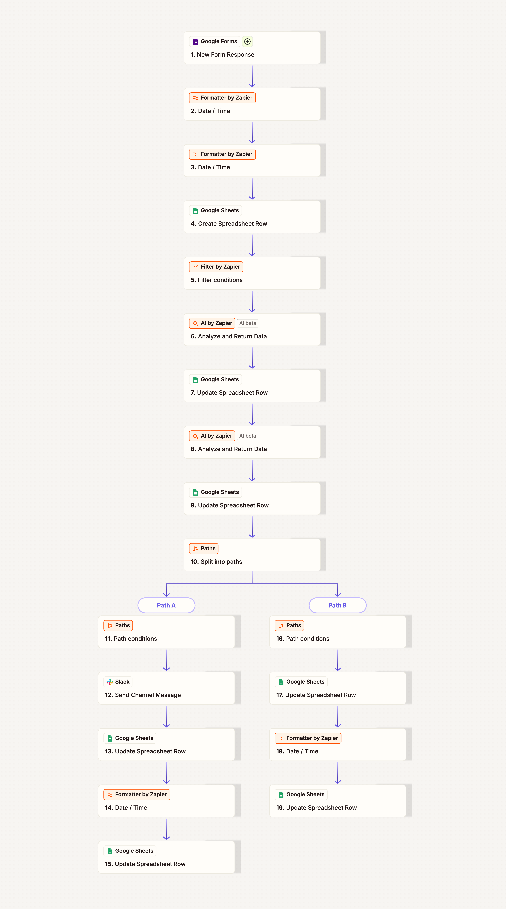

# Zapier Automation Demo: Review Monitoring with Sentiment Analysis & Alerting

## Overview
Automated system that captures customer reviews via Google Forms, performs AI-powered sentiment analysis, sends Slack alerts for negative feedback, and tracks end-to-end processing metrics—all in real-time.

## Workflow Architecture

## Detailed Workflow

### 1. Trigger & Time Normalization
- **Trigger**: New review submitted via Google Forms
- **Formatter Step 1**: Convert form submission timestamp to UTC
- **Formatter Step 2**: Calculate ingest delay (difference between submission time and system processing time in UTC)

### 2. Initial Logging
- **Create Row** in Google Sheets with:
  - Full review text
  - Received timestamp (UTC)
  - Ingest delay (minutes and seconds)
  - Review source identifier
  - Placeholder columns for AI-generated analysis

### 3. AI Analysis - Summary Generation
- **Filter**: Check if summary already exists (prevents duplicate processing on re-runs)
- **ChatGPT Call #1**: Generate neutral, actionable summary
  - **Prompt**: *"You are an AI customer-experience analyst tasked with summarizing customer feedback. Please summarize the following customer review in one neutral, professional sentence containing 15 to 25 words. Ensure that you include the customer's main point while avoiding emotional language."*
  - **Output**: 15-25 word professional summary
- **Update Row**: Write summary to tracking sheet

### 4. AI Analysis - Sentiment Classification
- **ChatGPT Call #2**: Binary sentiment determination
  - **Prompt**: *"You are a precise sentiment analysis service. Always return only boolean TRUE or FALSE. No code fences or extra text. Determine whether this customer review expresses negative sentiment."*
  - **Output**: TRUE (negative) or FALSE (not negative)
- **Update Row**: Write sentiment classification (Is Negative?) to tracking sheet

### 5. Conditional Path Routing

#### Path A: Negative Review (Is Negative = TRUE)
1. **Slack Alert**: Post message to monitoring channel
   > ***Negative Review Received***  
   > Review Summary: [AI-generated summary]  
   > Review Source: [Source identifier]
2. **Log Alert Status**: Update row with "Slack Sent = TRUE"
3. **Calculate Processing Time**: Compare current system time (UTC) with initial timestamp
4. **Update Row**: Write total processing delay (minutes and seconds)

#### Path B: Positive/Neutral Review (Is Negative = FALSE)
1. **Skip Alert**: No immediate notification needed
2. **Log Alert Status**: Update row with "Slack Sent = FALSE"
3. **Calculate Processing Time**: Compare current system time (UTC) with initial timestamp
4. **Update Row**: Write total processing delay (minutes and seconds)

## Technical Design Decisions

### Time Tracking Architecture
- All timestamps normalized to UTC to ensure accuracy across time zones
- Two distinct time measurements:
  - **Ingest Delay**: Time between form submission and Zapier trigger (measures platform latency)
  - **Processing Delay**: End-to-end time from trigger to completion (measures workflow performance)
- Dual tracking enables identification of bottlenecks and performance optimization

### AI Prompt Engineering
- **Summary prompt** enforces specific constraints (15-25 words, neutral language) for consistency and downstream usability
- **Sentiment prompt** requests strict boolean format to eliminate parsing complexity and enable reliable conditional routing
- Sequential API calls allow summary reuse across workflow without regeneration

### Workflow Architecture Notes
- Originally designed as multi-source system (forms, web scrapers, API injectors) with dynamic source tracking
- Simplified to Google Forms trigger for workshop demonstration while maintaining extensible data structure
- Filter step prevents duplicate processing (defensive design retained from original two-zap architecture)
- Both conditional paths update identical schema to maintain data integrity

## Workshop Learning Objectives
- Implementing multi-stage AI workflows with sequential ChatGPT API calls
- Designing conditional logic based on AI-generated classifications
- Building comprehensive audit trails with granular time tracking
- Using prompt engineering to control AI output format and reliability
- Creating escalation systems that balance automation with human oversight
- Understanding trade-offs between trigger types (form submission vs. new row vs. scheduled polling)

## Business Value
- **Speed**: Complete analysis and routing in seconds vs. hours of manual review
- **Consistency**: Standardized summaries enable pattern identification and faster team response
- **Prioritization**: Negative sentiment triggers immediate team awareness via Slack
- **Analytics**: Comprehensive time-tracking differentiates platform delays from workflow performance
- **Scalability**: Handles unlimited review volume with zero marginal cost per review
- **Extensibility**: Architecture supports multiple review sources (forms, APIs, web scraping) with minimal modification

## Key Metrics Tracked
| Metric | Purpose |
|--------|---------|
| Ingest Delay | Measures platform/trigger latency |
| Processing Delay | Measures end-to-end workflow performance |
| Review Summary | Enables quick team review without reading full text |
| Sentiment Classification | Binary TRUE/FALSE for filtering and routing |
| Slack Alert Status | Tracks which reviews triggered team notifications |
| Review Source | Supports multi-channel review aggregation |

## Use Cases Demonstrated
- Customer feedback monitoring for SaaS products
- Restaurant/hospitality review management  
- E-commerce product review triage
- Support ticket sentiment analysis
- Multi-channel review aggregation (social media, Google, Yelp, etc.)
- Any scenario requiring rapid identification and escalation of negative feedback

## Technical Stack
- **Zapier**: Workflow orchestration and integration platform
- **Google Forms**: Review collection interface (demo trigger source)
- **Google Sheets**: Data persistence and audit trail
- **OpenAI ChatGPT API**: AI-powered summarization and sentiment analysis
- **Slack API**: Team alerting and notification system